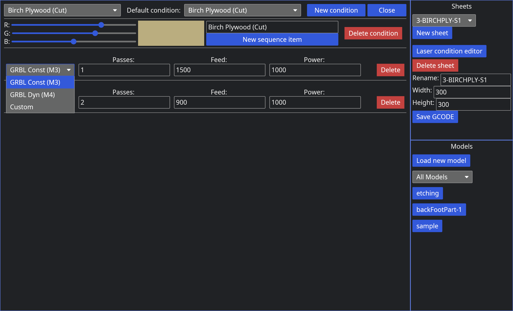

# 0.2.1
## Additions
- Added an `ArcToLines` type that takes an arc and generates line segments roughly corresponding to
    the arc. This will be useful when we allow arcs and circles into the DXF loader.
- Added utility functions to transform all 3 vector/point types and convert between them.
- Added a way to convert between Y-up and Y-down coordinate systems.

### Laser condition types
We now support GRBL Constant and Dynamic modes along with a custom GCODE option for defining what
gcode your laser uses.

## Changes
- Laser conditions now check if they have been modified before saving
- Sheet view is no longer flipped. Now 0,0 is properly placed in the bottom left.
    (This was more difficult that I thought to get working).
- Models are now fully represented using [`geo`'s](https://crates.io/crates/geo) `Polygon` types and
    they generate a `ConvexHull` for the bounding box to make complex, disconnected DXF files easier
    to manipulate.
- The laser conditions config file is now serialized as Pretty, so users can read it if they want.
- Laser conditions now keep their order when being saved and reloaded. This was a minor change, but
    improves the UX when selecting conditions a lot.
- Program no longer crashes with an invalid config. It just logs the error to STDOUT.
- All number input boxes now keep whatever number you type in instead of reformatting its value.
- When changing scale, if the box is empty it does not update the scale until there is a valid
    number.
- Updated GCODE generation to account for the new laser condition settings
- "Optimized" the line rendering in the sheet view so it doesn't recreate the paths every time
    something is moved, the view is panned, or scaled. Now it only updates the specific entity's
    paths when it is moved on the sheet. Nothing gets recalculated when the view is panned or
    zoomed.

### Selecting between stacked entities and moving them
Before when two entities were stacked on each other, you could not select between the different
entities. Now you can just click the same spot again (with a small movement tolerance) and it will
select the next entity under the cursor.

Additionally, when moving stacked entities it would chose the oldest one and move that one. As
mentioned above, it cycles the selection, and when you click, release, then click-and-drag, it now moves
the one you expect (or at least the one I expect).

# 0.1.0
# Additions
Everything. The world. The galaxy. All life.

Not really. Just these things:
- A way to load DXF files
- A way to move those files around in a viewer
- Customizing the sheet sizes
- Laser feed and power settings per-sheet
- A list of loaded models and their names
- A text box to name sheets even though we can't save them yet
- Generating GCODE from a nested sheet of models
- Deleting a sheet
