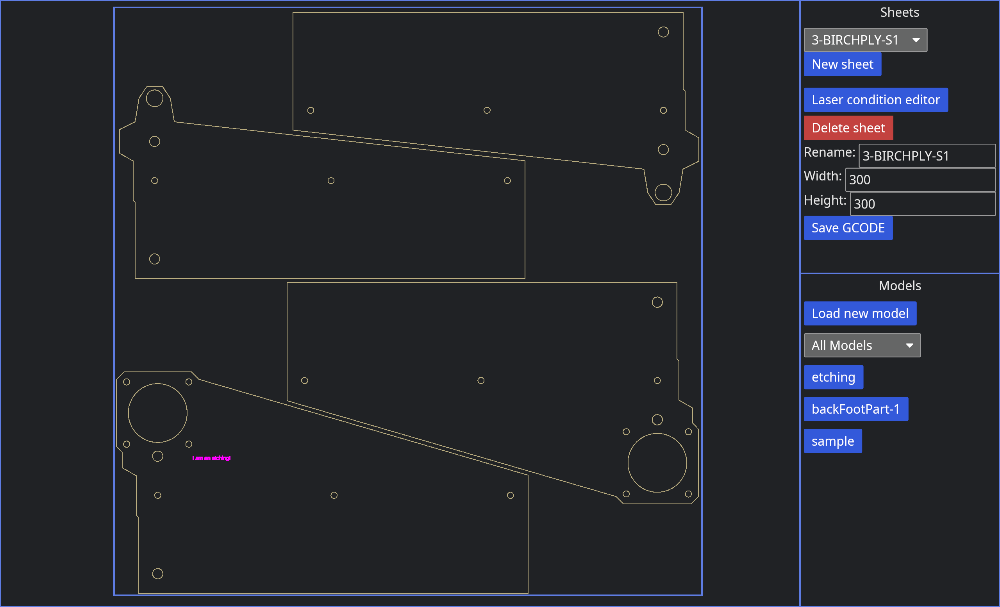
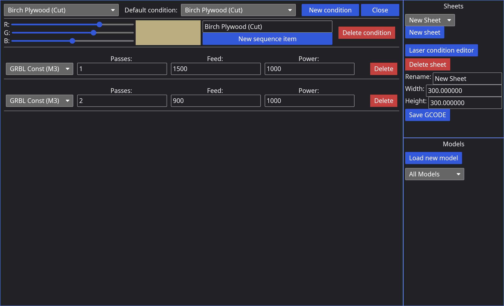
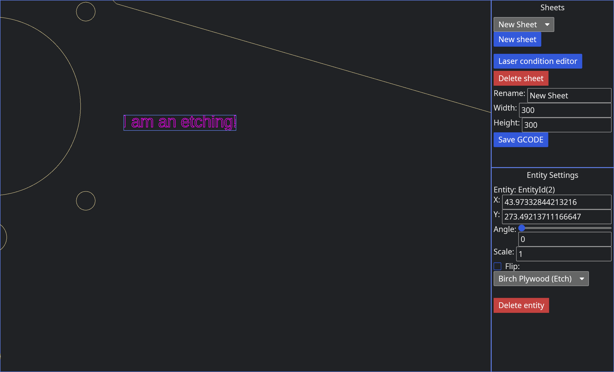

# LaserCAM
This is LaserCAM, a simple bit of software to nest DXF files and generate GCODE for a GRBL laser
cutter. It is designed to be as simple as possible and somewhat mimic the Amada VPSS software I use
at work.

## DXF file caveats
We only support lines and assume everything is already flat with no Z variations when rotated into
the XY plane.

### Why only lines?
I use OpenSCAD to model my plywood parts and it apparently only ever exports lines, so this is all
I am supporting for now.

## Dictionary of terms
### Entity
An entity is simply an instance of a model with a transform and scale applied. This is to reduce
duplication of models.

### Model
A collection of lines that form a part with a single possibly convex outline and zero or more holes.

### Sheet
An area that represents some physical material where entities can be moved, rotated, and scaled.

## List of features (roadmap)
- 🗹 DXF Loading
- 🗹 Recognize lines from line segments
- 🗹 Rotate parts if they are not in the XY plane

- 🗹 Text GUI
- 🗹 Adding sheets, deleting sheets, and changing the size of sheets
- 🗹 Adding and deleting entities
- 🗹 Editing the transform and scale of entities
- 🗹 Loading and instantiating models that the user chooses

- 🗹 Rendering of the build space
- 🗹 Rendering of a sheet of material
- ⁇ (Optional) add color to the sheet material
- 🗹 Line rendering for the model

- 🗹 Navigation for the line rendering (pan and zoom)

- 🗹 GCODE output of the nested program

- ☐ Rectangle selection thing

- ☐ Configurable "laser conditions" where the laser operates at different powers, speeds, and passes
- ☐ Per-entity laser conditions
- ☐ Coloring of lines with different laser conditions

- ☐ GCODE simulator with coloring

- ☐ Detection of out-of-bounds entities using the outline and sheet border

- ☐ Saving and loading nested sheets

## Screenshots
The laser condition editor:

Sheet editor:

## DISCLAIMER
This is (at the time of writing) UNTESTED software. The GCODE generated may be wrong, it may be
invalid, and it might just look bad.
